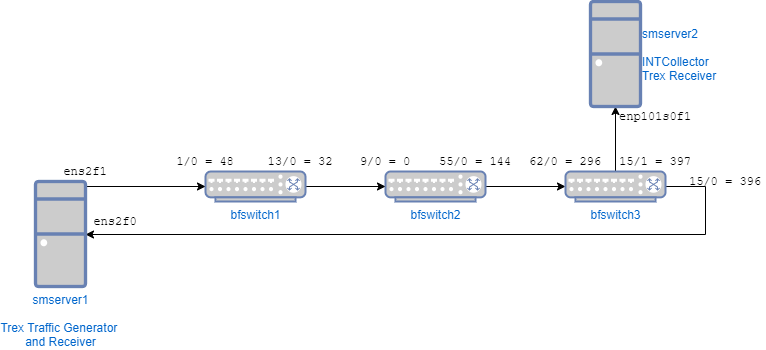

# In-Band Network Telemetry Implementation in P4

**INT-MD - eMbed Data (version 1.0)**

## Build

The P4 code can be compiled by using the build script in the SDE
```
./p4_build.sh int_md_1_0.p4
```

The following topology can be referred to for the INT-MD mode of operation:


## Usage

Run the P4 code as follows
```
$SDE/run_switchd.sh -p int_md_1_0
```

### Populating the tables and registers

In another window for each switch, the following command can be run depending on the role of the INT node
```
$SDE/run_bfshell.sh -b $P4-INT/int-md-1-0/bfrt_python/bfswitch1.py
```

### Testing the INT program

Packets can be sent from server1, and tcpdump/wireshark can be used to see the output at the monitoring server and the receiver. The wireshark script in the folder can be used to dissect INT data in wireshark. Launch this with 
```
$ wireshark -X lua_script:int_telemetry_report.lua
```

### Hardware Setup

The hardware setup with the two servers and three switches can be seen in the following figure. 



### TRex

The [TRex](https://trex-tgn.cisco.com/) program was used to generate traffic in order to test the INT implementation. TRex v2.87 was used as a [GUI](https://github.com/cisco-system-traffic-generator/trex-stateless-gui) was available for this version. The stateless mode of TRex was used. 

These were the steps used to install and run TRex, latest version:
* Download TRex
  ```
    [bash]>wget --no-cache https://trex-tgn.cisco.com/trex/release/latest
    [bash]>tar -xzvf latest
  ```
* Identify and assign ports. The NIC used in this case was the Intel XXV710. This script lists available interfaces, and it is used to create a TRex config file. 
  ```
    [bash]>sudo ./dpdk_setup_ports.py -i
  ```
* Once configured, TRex stateless mode can be run on both servers, sender and listener. The -c flag determines how many cores shall be utilised. 
  ```
    ./t-rex-64 -i -c 4
  ```
* On another window, the TRex console can be run and used to send and receive data. `tui` can be used to launch a user interface
  ```
    ./trex-console
    tui
  ```
* Example to send data from the sender, packets should be captured on the receiver
  ```
    start -f stl/udp_1pkt_simple.py -p 1 -d 10 -m 10kbps
  ```
  
 
### INTCollector

With this mode of operation, traffic can be analysed visually using [INTCollector](https://gitlab.com/tunv_ebpf/BPFCollector/). Install this as per the instructions in the repository. This implementation has been tested with Linux kernel `4.15` using Ubuntu 18.04, it has not been updated for more recent kernels. The InfluxDB implementation was used, along with Grafana. Examples of output from this program can be seen in the Figures below. 

* Install bcc
  ```
    # Install build dependencies - For Bionic (18.04 LTS)
        sudo apt-get -y install bison build-essential cmake flex git libedit-dev \
        libllvm6.0 llvm-6.0-dev libclang-6.0-dev python zlib1g-dev libelf-dev libfl-dev
    
    # Install and compile BCC
        git clone https://github.com/iovisor/bcc.git
        mkdir bcc/build; cd bcc/build
        cmake ..
        make
        sudo make install
        cmake -DPYTHON_CMD=python3 .. # build python3 binding
        pushd src/python/
        make
        sudo make install
        popd
  ```
* Clone INTCollector repo
  ```
    git clone https://gitlab.com/tunv_ebpf/BPFCollector.git
  ```
* Install requirements
  ```
    sudo pip3 install -r requirements.txt
  ```
* Install InfluxDB
  ```
      wget https://dl.influxdata.com/influxdb/releases/influxdb_1.2.4_amd64.deb
      sudo dpkg -i influxdb_1.2.4_amd64.deb
      sudo systemctl start influxdb
  ```
* Install Grafana
  ```
      sudo apt-get install -y apt-transport-https
      sudo apt-get install -y software-properties-common wget
      wget -q -O - https://packages.grafana.com/gpg.key | sudo apt-key add -
      echo "deb https://packages.grafana.com/enterprise/deb stable main" | sudo tee -a /etc/apt/sources.list.d/grafana.list
      sudo apt-get update
      sudo apt-get install grafana-enterprise
      sudo systemctl start grafana-server
  ```
* Example to run INTCollector for a port that listens to telemetry reports. 
  ```
      sudo python3 InDBClient.py eth_1
  ```
  
* Some fields in INTCollector can be changed
  ```
      * Debug flags can be set in InDBCollector.pyx and InDBClient.py.
      * The mode between Interval and Threshold can be changed in these files.
      * The threshold and interval values can be changed in the BPFCollector.c file. 
  ```


