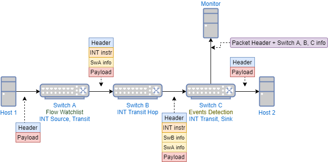

# In-Band Network Telemetry Implementation in P4

**INT-MD - eMbed Data (version 1.0)**

## Build

The P4 code can be compiled by using the build script in the SDE
```
./p4_build.sh int_md_1_0.p4
```

The following topology can be referred to for the INT-MD mode of operation:


## Usage

Run the P4 code as follows
```
$SDE/run_switchd.sh -p int_md_1_0
```

### Populating the tables and registers

In another window for each switch, the following command can be run depending on the role of the INT node
```
$SDE/run_bfshell.sh -b $P4-INT/int-md-1-0/bfrt_python/bfswitch1.py
```

### Testing the INT program

Packets can be sent from server1, and tcpdump/wireshark can be used to see the output at the monitoring server and the receiver. The wireshark script in the folder can be used to dissect INT data in wireshark. Launch this with 
```
$ wireshark -X lua_script:int_telemetry_report.lua
```

### Hardware Setup

The hardware setup with the two servers and three switches can be seen in the following figure. 


### TRex

The [TRex](https://trex-tgn.cisco.com/) program was used to generate traffic in order to test the INT implementation. TRex v2.87 was used as a [GUI](https://github.com/cisco-system-traffic-generator/trex-stateless-gui) was available for this version. The stateless mode of TRex was used. 

### INTCollector

With this mode of operation, traffic can be analysed visually using [INTCollector](https://gitlab.com/tunv_ebpf/BPFCollector/). Install this as per the instructions in the repository. This implementation has been tested with Linux kernel `4.15`. The InfluxDB implementation was used, along with Grafana. Examples of output from this program can be seen in the Figures below. 


